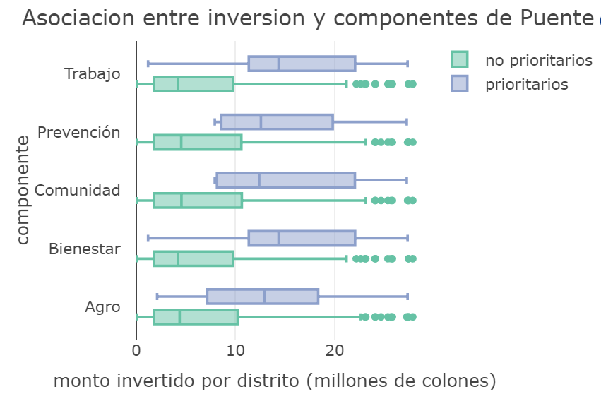

# Ayuda

#### Asociación entre la inversión social por distrito y los ejes prioritarios de Puente al Bienestar

***
***
Este gráfico pretende mostrar si la inversión social del programa elegido se distribuye según los distritos prioritarios de cada uno de los [Ejes de Puente al Bienes](https://presidencia.go.cr/comunicados/2019/03/gobierno-presenta-politica-social-del-bicentenario/)

***

  
Un programa que mantenga una relación con determinado `Eje` de Puente debería presentar una distribución del monto invertido por distrito mayor para los `distritos prioritarios` (caja azul), o más hacia la derecha, que la de los `no prioritarios` (caja verde) como en el caso de **Pronae** (derecha)

  

  

